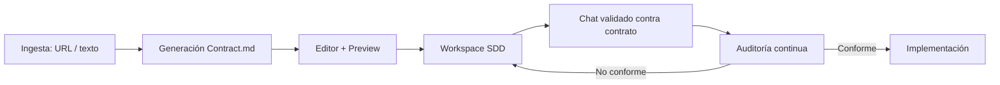

<div align="center">
  
  
  
  
  
  
  <br/>
  
  
  
</div>

<br/>

<div align="center">
  <h1>⚖️ AI Contract Architect · <span style="color:#2ea44f">SDD</span></h1>
  <p><strong>“No programes con un esclavo digital, construye con un Senior Partner.”</strong><br/>
  <em>“El código es efímero, la arquitectura es eterna. Firma tu contrato hoy.”</em></p>
</div>

<p align="center">
  <a href="#-por-qué-sdd">✨ Por qué SDD</a> •
  <a href="#-flujo-del-producto">📦 Flujo</a> •
  <a href="#-stack-técnico">🛠️ Stack</a> •
  <a href="#-puesta-en-marcha">🚀 Empezar</a> •
  <a href="#-scripts-clave">📜 Scripts</a> •
  <a href="#-seguridad-y-gobernanza">🔒 Seguridad</a> •
  <a href="#-manifiesto-sdd">📜 Manifiesto</a>
</p>

---
```markdown
## ✨ ¿Por qué SDD?

**AI Contract Architect** es un framework **Contract‑First** para colaborar con inteligencia artificial **sin generar deuda técnica**. Convierte la interacción humano‑IA en un **Desarrollo Basado en Constitución (Contract.md)**, incorporando gobernanza, límites arquitectónicos y auditoría continua.

- 🛡️ **Gobernanza proactiva**: el contrato define límites de complejidad, patrones permitidos y reglas de seguridad.
- 🤝 **Relación de igualdad**: la IA actúa como arquitecta con derecho a veto si una instrucción viola la arquitectura o la seguridad.
- 🧠 **Memoria compactada**: protocolos de resumen del contexto para evitar alucinaciones y mantener el foco.

## 📦 Flujo del producto
``` 

```markdown
1. **Ingesta y alineación**  
   Analiza una URL de GitHub (a través de **Jina Reader**) o texto libre para generar un `Contract.md` ajustado al contexto.

2. **Blindaje arquitectónico**  
   El contrato fija los **Task Boundaries**: qué puede y qué no puede hacer la IA.

3. **Auditoría en tiempo real**  
   Toda propuesta de la IA se valida contra el contrato. Si viola seguridad, carece de tests o tipado, se marca como **“No conforme”**.

## 🛠️ Stack técnico

| Categoría          | Tecnologías                                                                                     |
|--------------------|-------------------------------------------------------------------------------------------------|
| **Frontend**       | React 19 + TypeScript + Vite 7                                                                 |
| **Estilos**        | Tailwind CSS 3 + `@tailwindcss/typography` + `tailwindcss-animate`                             |
| **Iconos**         | lucide-react                                                                                    |
| **Testing**        | Vitest + Testing Library (jsdom)                                                                |
| **Calidad código** | ESLint + Prettier + TypeScript strict                                                           |
| **IA**             | Google Gemini API (via Vite)                                                                    |

## 🚀 Puesta en marcha

### 1. Obtener una API key de Gemini

1. Ve a [Google AI Studio](https://makersuite.google.com/app/apikey).  
2. Inicia sesión con tu cuenta de Google.  
3. Haz clic en **“Get API key”** → **“Create API key”**.  
4. Selecciona o crea un proyecto y **copia la clave generada**.

### 2. Clonar el repositorio e instalar dependencias

```bash
git clone https://github.com/tu-usuario/ai-contract-architect.git
cd ai-contract-architect
npm install
```
```markdown
### 3. Configurar variables de entorno

Crea un archivo `.env` en la raíz del proyecto con el siguiente contenido:

```ini
VITE_GEMINI_API_KEY=tu_clave_de_gemini_aqui
```

> **⚠️ Importante**: reemplaza `tu_clave_de_gemini_aqui` por la clave que obtuviste en el paso anterior.  
> El prefijo `VITE_` es necesario para que Vite exponga la variable al frontend de forma segura.

### 4. Ejecutar en modo desarrollo

```bash
npm run dev
```

La aplicación estará disponible en `http://localhost:5173` (o el puerto que Vite indique).

### 5. Compilar para producción

```bash
npm run build
npm run preview
```

## 📜 Scripts clave

| Comando               | Descripción                                    |
|-----------------------|------------------------------------------------|
| `npm run dev`         | Inicia el servidor de desarrollo               |
| `npm run lint`        | Ejecuta ESLint                                 |
| `npm run typecheck`   | Verifica tipos con TypeScript                  |
| `npm run test`        | Ejecuta las pruebas (Vitest)                   |
| `npm run format`      | Muestra diferencias de formato (Prettier)      |
| `npm run format:fix`  | Corrige automáticamente el formato             |
| `npm run build`       | Genera la versión de producción                 |
| `npm run preview`     | Previsualiza la compilación de producción       |

## 📁 Estructura del código (principales archivos)

```bash
src/
├── App.tsx               # Flujo principal (pasos 1, 2, 3)
├── index.css             # Estilos base + Tailwind
├── env.d.ts              # Tipado para variables de entorno
├── test/                 # Configuración y pruebas
│   ├── setup.ts
│   └── App.test.tsx
├── components/           # (opcional) Componentes reutilizables
└── ...
```

- `vite.config.ts` – Configuración de Vite y Vitest.  
- `tailwind.config.js` / `postcss.config.js` – Configuración de Tailwind y PostCSS.

## 🔒 Seguridad y gobernanza

- La IA tiene **derecho a veto** si una acción viola el contrato.  
- Las claves de API y secretos **nunca** se incluyen en el repositorio; se usan variables de entorno (`.env` local, ignorado por Git).  
- La auditoría continua (lint, typecheck, tests) forma parte de la **Definición de Hecho** (DoD).

## 📜 Manifiesto SDD (resumen)

- **Relación de igualdad (Senior Partnership)**  
  La IA no es un simple autocompletado; colabora y hace cumplir la arquitectura.  
- **Gobernanza proactiva**  
  Límites de complejidad, reglas de seguridad (OWASP/estáticos) integradas.  
- **Memoria compactada**  
  Resúmenes periódicos del contexto para mantener precisión y foco.

---

## 🧑‍💻 Conecta con el creador

¿Te gusta el proyecto? ¿Quieres contribuir o debatir sobre SDD?  
Puedes encontrarme en:

<p align="center">
  <a href="https://github.com/tu-usuario"></a>
  <a href="https://linkedin.com/in/tu-linkedin"></a>
  <a href="https://tu-portfolio.com"></a>
  <a href="mailto:tu@email.com"></a>
</p>

---

## 📄 Licencia

Distribuido bajo la licencia MIT. Ver `LICENSE` para más información.

---

<div align="center">
  <sub>Hecho con ❤️ y ☕ por <a href="https://github.com/tu-usuario">Tu Nombre</a></sub>
  <br/>
  <sub>✨ <strong>AI Contract Architect</strong> – donde la arquitectura y la IA firman la paz. ✨</sub>
</div>
```
